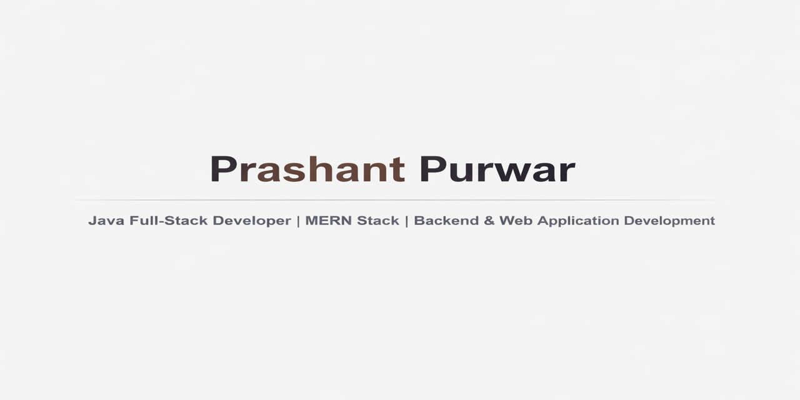

# Hi, I'm Prashant 👋

Java Full-Stack Developer | MERN Stack | Backend Development

I build scalable and secure web applications with a strong focus on backend development, clean architecture, and real-world problem solving. I have hands-on experience with Java-based systems and practical exposure to the MERN stack. Completed a development internship at CodSoft working on production-style projects.

---

## 🚀 Projects
- **StudDesk** – Student Management System (Java, MVC, MySQL)
- **VaultX** – Secure ATM Web Application
- **CrisisConnect** – Emergency Assistance Web Platform

---

## 🛠 Skills
Java • JavaScript • SQL • Servlets • JSP • JDBC • Node.js • Express • React  
MySQL • MongoDB • REST APIs • MVC • DAO • Git • Maven • Apache Tomcat

---

## 📫 Contact
GitHub: https://github.com/prashantpurwar12  
LinkedIn: https://www.linkedin.com/in/prashant-purwar-230966264/  
Email: work.prashantpurwar@gmail.com
